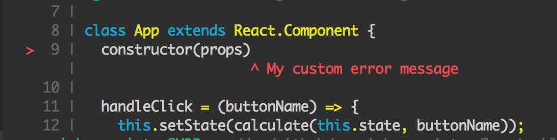

# Locateable Error

Display a nicely formatted excerpt of the location where an `Error` occured.
Works with single pointers or ranges.



## Installation

```bash
npm install @marvinh/locateable-error

# or with yarn
yarn add @marvinh/locateable-error
```

## Usage

All objects which should produce nice coder-exerpts must implement the
`Locateable` interface:

```ts
interface Locateable {
  message: string;
  source: { body: string; name: string };
  inlineMessage?: string;
  locations: Array<{ line: number; column: number }>;
}
```

and then call `formatLocateable` on your object:

```ts
import { formatLocateable, Locateable } from "@marvinh/locateable-error";

// Your object which implements the `Locateable` interface
const err: Locateable = {...}

// Get the formatted string
const out = formatLocateable(err);

console.log(out);
// Prints
// > 1 | foo asd
//     |  ^^^ fail
//   2 | asd ads
//   3 | asd"
```

## License

`MIT`, see [License file](./LICENSE.md)
